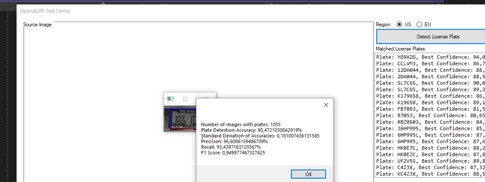

# License Plate Detection & Enhancement (C# + OpenALPR + OpenCV)

A computer vision research project on license plate detection, developed as
part of a Master's thesis at Üsküdar University (supervised by Dr. Ihab
Elaff). Includes a Windows Forms demo application and the documented
preprocessing pipeline that improved detection accuracy over a standard
OpenALPR baseline.

## Research Results

The system was evaluated on a license plate dataset of **1,128 images**
(evaluated using OpenALPR's pre-trained model for US license plates).

| Enhancement Method                             | Accuracy | Precision | Recall |
|-------------------------------------------------|---------:|----------:|-------:|
| OpenALPR (baseline)                              |   87.21% |    96.48% | 90.07% |
| Normalization                                    |   88.22% |    96.70% | 90.95% |
| Selective Gamma Correction + Normalization        |   90.47% |    96.60% | 93.43% |


Full breakdown and discussion: [`results/experiments-summary.md`](results/experiments-summary.md)
Methodology and pipeline architecture: [`docs/methodology.md`](docs/methodology.md)
Thesis summary: [`docs/thesis-summary.md`](docs/thesis-summary.md)

---

## Overview

This repository contains a demonstration version of a license plate
detection system built on OpenALPR. It shows the full pipeline:

- Loading and processing images with OpenALPR
- Detecting and displaying license plates
- Cropping detected regions and visualizing them
- Supporting both US and EU plate formats

## Demo Screenshots

The Windows Forms demo running each configuration, with live results from
the app itself:

| Baseline | Normalization | Selective Gamma + Normalization |
|---|---|---|
|  |  |  |
| 87.21% accuracy | 88.22% accuracy | 90.47% accuracy |

## Features

- Detects license plates from static images
- Displays recognition confidence and template matching
- Crops and visualizes detected plates
- Works with OpenALPR configuration and runtime data
- Clean Windows Forms GUI for demonstration

## Research Extension

The research phase of this project (see `docs/`) went beyond this demo GUI
and added:

- Batch processing across an image dataset
- Precision / recall / accuracy evaluation
- Enhanced preprocessing: Enhanced Histogram Equalization, Selective Gamma
  Correction, Adaptive Normalization
- **+3.26 point accuracy gain** over the OpenALPR baseline (see results above)

## Requirements

- Windows 10 or later
- Visual Studio 2022
- .NET Framework 4.8
- OpenALPR SDK for .NET

## Project Structure

```
PlateDetectionDemo/
├── AlprNetGuiTest.csproj / plates.csproj / plates.sln   # C# WinForms app
├── Form1.cs, Form1.Designer.cs, Program.cs
├── App.config
├── docs/
│   ├── thesis-summary.md
│   ├── methodology.md
│   └── screenshots/
├── results/
│   └── experiments-summary.md
├── README.md
└── LICENSE
```

## Academic Background

This project was developed as part of a Master's thesis:
**"License Plate Detection and Enhancement"** — Üsküdar University
(supervised by Dr. Ihab Elaff), successfully defended and validated. This
public repository contains a demonstration build of the implemented system
plus the documented methodology and results.
