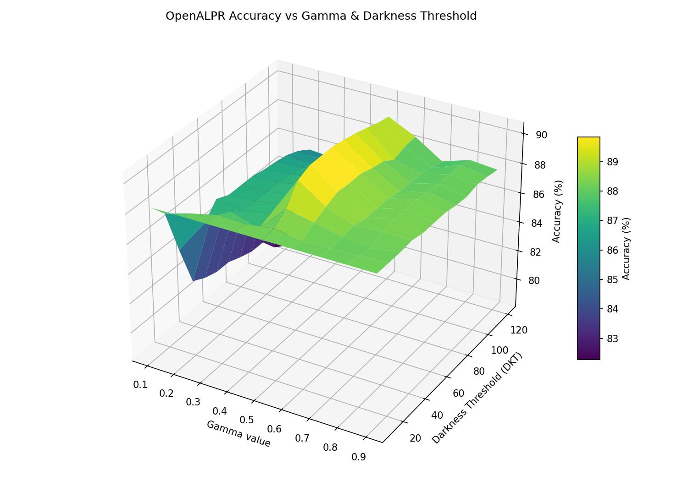
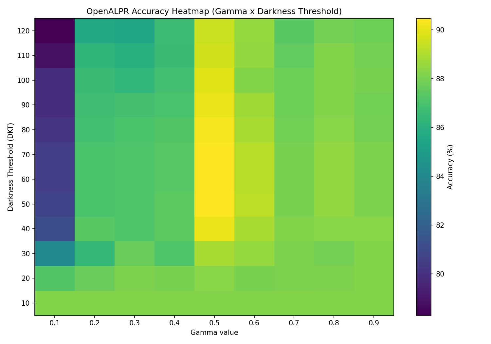
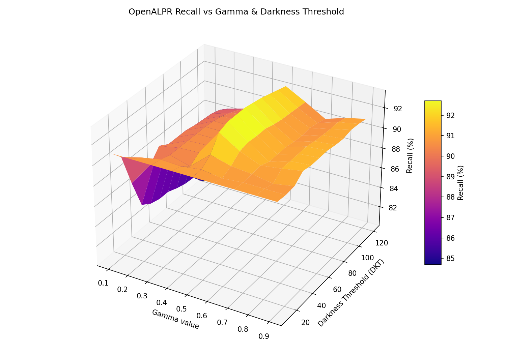
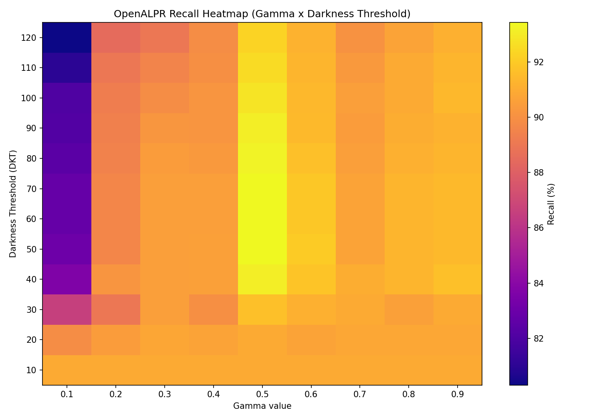
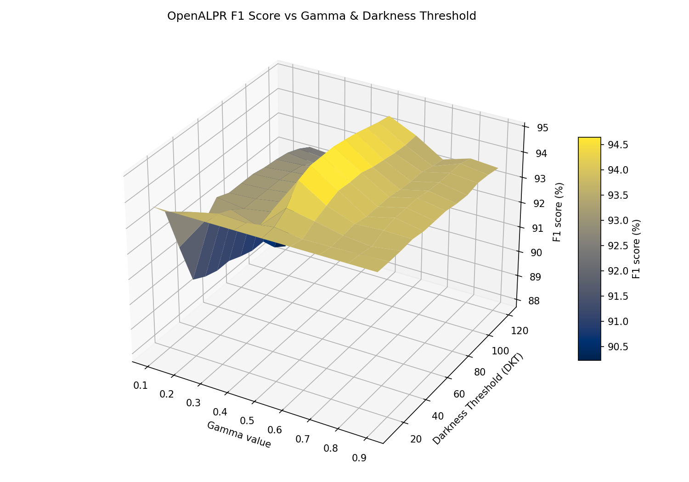
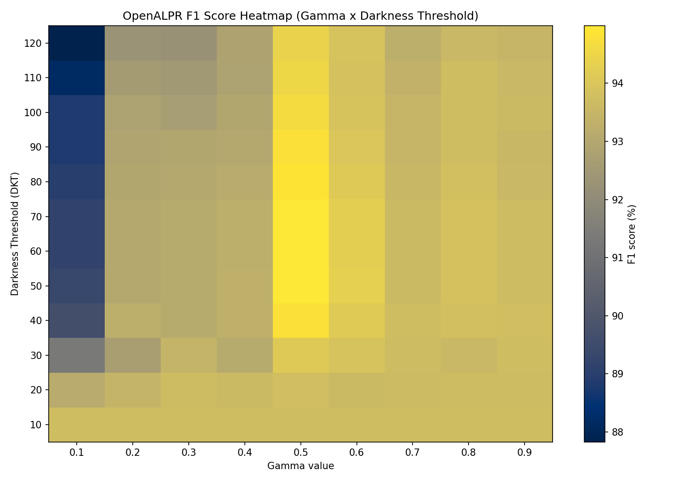
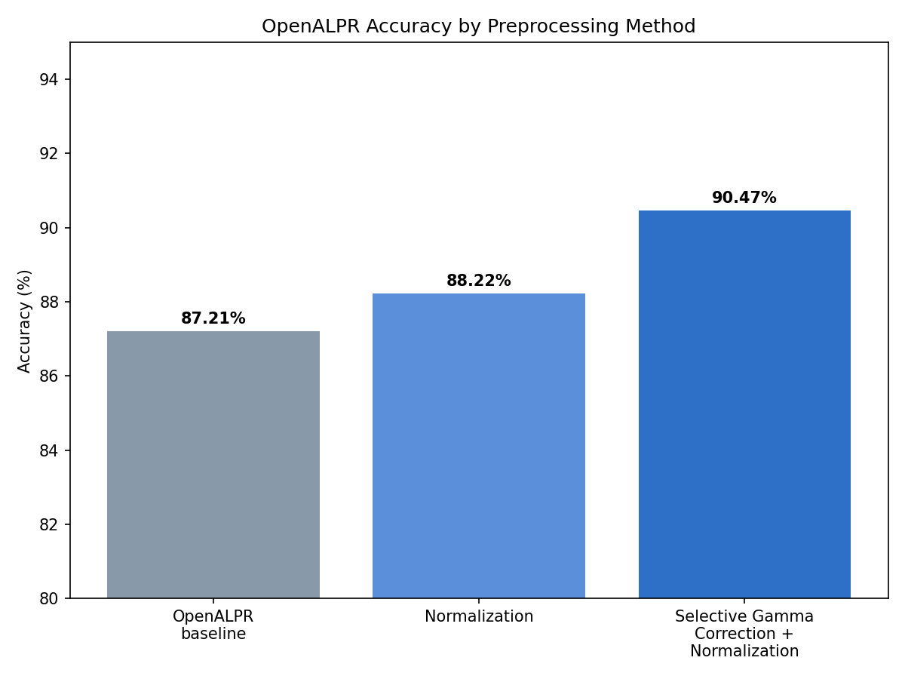

# Experimental Results

**Dataset:** 1,128 license plate images, evaluated using OpenALPR's
pre-trained model for US license plates. Best configuration (Table 8):
Selective Gamma Correction + Normalization, 90.47% accuracy / 96.60%
precision / 93.43% recall / 0.181 std. dev. / 1,055 images with plates
correctly detected.

## Table 3 — OpenALPR Performance with Various Enhancements

| Enhancement Method                             | Detection Accuracy (%) | Precision (%) | Recall (%) | Std. Deviation | # Images with Plates Detected |
|-------------------------------------------------|-----------------------:|--------------:|-----------:|---------------:|-------------------------------:|
| OpenALPR (baseline)                              |                   87.21 |          96.48 |      90.07 |          0.184 |                          1,022 |
| Normalization                                    |                   88.22 |          96.70 |      90.95 |          0.178 |                          1,030 |
| Selective Gamma Correction + Normalization       |                   90.47 |          96.60 |      93.43 |          0.181 |                          1,055 |

*(1,128 total images in the dataset — the last column is the count of
images in which a plate was correctly detected.)*

## Gamma / Darkness Threshold sweep

The best configuration (gamma = 0.5, darkness threshold = 50–70) was found
by sweeping gamma correction values against darkness thresholds across
three metrics — accuracy, recall, and F1 score (thesis Tables 4, 5, 7 /
Figures 15, 16, 17), all generated directly from the thesis data.

**Accuracy** (max 90.47% at gamma=0.5, DKT=50–70):

**Recall** (max 93.43% at gamma=0.5, DKT=50–60):

**F1 score** (max 94.99% at gamma=0.5, DKT=50–70):

## Interpretation

- The **+3.26 point** accuracy gain over the raw OpenALPR baseline comes
  entirely from preprocessing — the recognition engine itself is unchanged.
- Precision stays essentially flat across methods (96.48% → 96.70% →
  96.60%) — the preprocessing gain comes almost entirely from **recall**
  (90.07% → 93.43%), i.e. the pipeline detects more of the plates that were
  previously missed, without introducing more false positives.
- The accuracy/recall/F1 sweep shows a clear, consistent optimum around
  **gamma = 0.5** and **darkness threshold = 50–70** across all three
  metrics — outside that range, results degrade in both directions (e.g.
  recall drops to 80.31% at gamma=0.1, DKT=120), which is why "selective"
  gamma correction (applied conditionally rather than globally) matters:
  a single fixed gamma value would help some images and hurt others.
